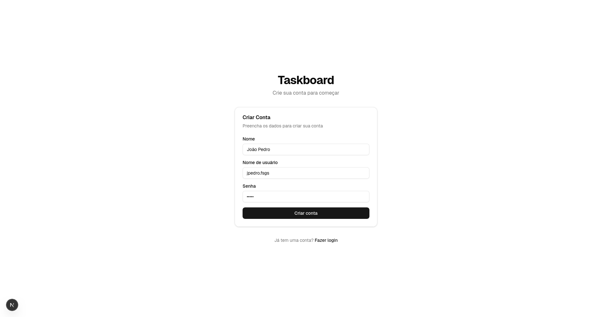
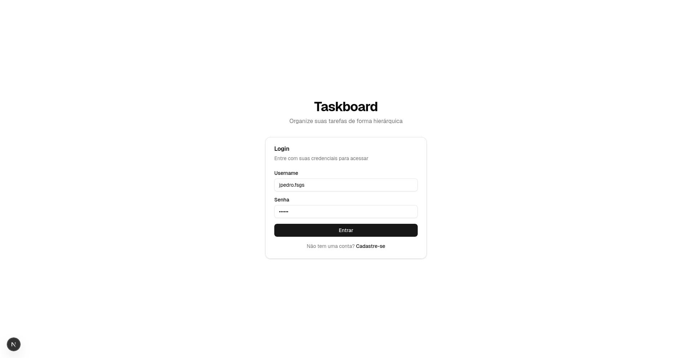
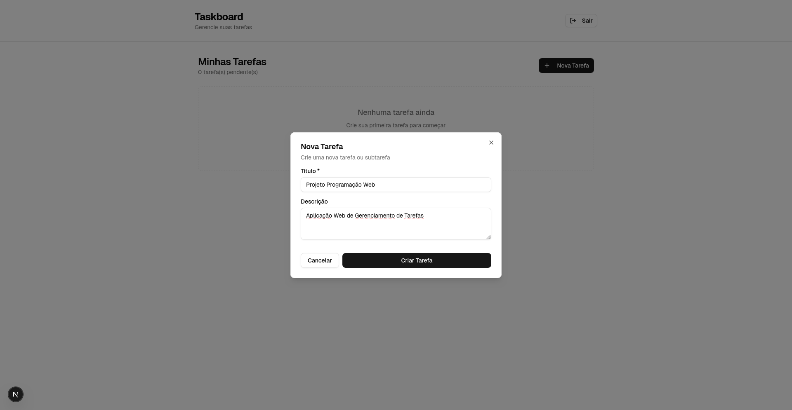
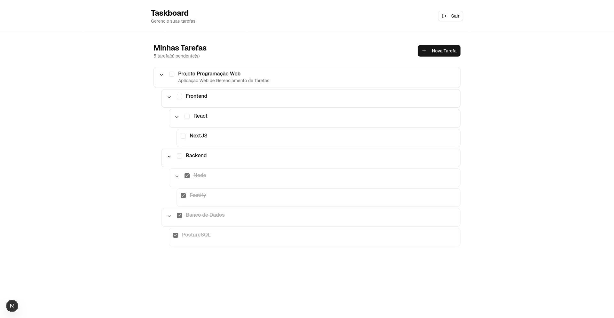

# Taskboard Frontend

Frontend da aplicação Taskboard — uma interface web para gerenciar tarefas e quadros de tarefas.

**Descrição:**
- Projeto frontend construído com Next.js e TypeScript, organizado com a nova estrutura de `app/`. Fornece telas de autenticação (login/registro) e uma área principal para visualização e manipulação de tarefas.

**Funcionalidades principais:**
- Autenticação básica (login e registro) — formulários e fluxos de UI.
- Listagem e exibição de tarefas com componentes reutilizáveis.
- Componentes de interface (botões, inputs, diálogos, cartões, skeletons) prontos para compor a aplicação.
- Design modular: componentes organizados por domínio (`components/auth`, `components/tasks`, `components/ui`).

**Stack e tecnologias:**
- Next.js (app router) + React
- TypeScript
- PostCSS para processamento de estilos
- Arquitetura baseada em componentes e hooks

**Visão geral da estrutura do repositório:**
- `app/` — rotas e páginas da aplicação (inclui `login`, `register`, `tasks`).
- `components/` — componentes UI e de domínio (autenticação, lista de tarefas, elementos reutilizáveis).
- `hooks/` — hooks customizados (ex.: `use-mobile`).
- `lib/` — utilitários e helpers.
- `public/` e `styles/` — ativos estáticos e estilos globais.

## Como executar localmente

- Instalar dependências:

```bash
npm install
```

- Rodar em modo desenvolvimento:

```bash
npm run dev
```

- Build e iniciar em produção:

```bash
npm run build
npm run start
```

- Requisitos / observações:
  - Recomenda-se Node.js 18+.
  - Garanta que o backend (API) esteja rodando e acessível; a aplicação faz requisições para rotas em `/api/*`.
  - Defina a URL da API como a váriavel de ambiente NEXT_PUBLIC_API_URL

## Screenshots

Exemplos da interface (imagens presentes na pasta `public/`):

- Cadastro



- Login



- Minhas Tarefas (criação)



- Minhas Tarefas (visualização)


